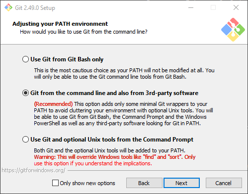
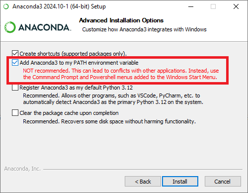
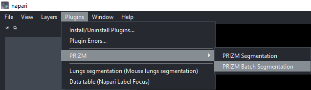
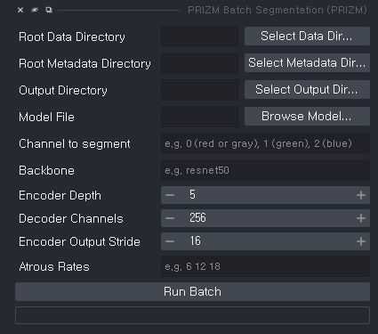

# prizm-public

PRIZM is a napari-based toolkit for zebrafish cardiac analysis. This codebase focuses on the currently exposed GUI tools and
matching command-line interfaces for:

- PRIZM Batch Segmentation
- PRIZM MoA 2-Stage Prediction
- PRIZM MiniPanel Heatmap/LDA

Name guide for new users:

- `prizm-public`: the GitHub repository name and the folder name you will
  clone onto your computer
- `prizm-napari`: the Python package name that gets installed when you run
  `pip install .`
- `PRIZM`: the name you will see inside the napari `Plugins` menu

## Table of Contents

- [Overview](#overview)
- [Requirements](#requirements)
- [Installation](#installation)
- [How to Confirm PRIZM Installed Correctly](#how-to-confirm-prizm-installed-correctly)
- [Reinstall / Update](#reinstall--update)
- [Running Demo Dataset](#running-demo-dataset)
- [GUI Usage](#gui-usage)
  - [PRIZM Batch Segmentation](#prizm-batch-segmentation)
  - [PRIZM MoA 2-Stage Prediction](#prizm-moa-2-stage-prediction)
  - [PRIZM MiniPanel HeatmapLDA](#prizm-minipanel-heatmaplda)
- [Command-Line Usage](#command-line-usage)
  - [`prizm-batch-segmentation`](#prizm-batch-segmentation-1)
  - [`prizm-moa-2stage`](#prizm-moa-2stage)
  - [`prizm-minipanel-analysis`](#prizm-minipanel-analysis)
- [License](#license)

## Overview

This repository provides the PRIZM napari plugin and companion CLIs for:

- batch segmentation and downstream functional analysis from organized
  image folders
- 2-stage mode-of-action prediction from `PerFishMetrics_*.xlsx`
  workbooks
- MiniPanel visualization and statistics from
  `PerFishMetrics_*.xlsx` workbooks

The napari manifest currently exposes three widgets:

- `PRIZM Batch Segmentation`
- `PRIZM MoA 2-Stage Prediction`
- `PRIZM MiniPanel Heatmap/LDA`

## Requirements

PRIZM is a Python package and napari plugin. The package requires
Python 3.10 or newer. The current release has been validated on
Windows 11 and Ubuntu 24.04.2 LTS.

CPU execution does not require non-standard hardware. GPU inference is
optional and requires an NVIDIA GPU with a compatible NVIDIA driver and
CUDA/cuDNN runtime. The demo run below was validated on Ubuntu 24.04.2
LTS with NVIDIA GeForce RTX 3080 GPU, NVIDIA driver 580.159.03, and
CUDA 13.0.

The README installation and demo commands were validated with these
software versions:

<details>
  <summary>Tested software versions (click to expand)</summary>

| Software | Tested version |
| --- | --- |
| PRIZM package | `prizm-napari 0.0.1` |
| Python | `3.12.13` |
| Conda | `25.5.1` |
| napari | `0.7.0` |
| magicgui | `0.10.2` |
| PyQt5 | `5.15.11` |
| QtPy | `2.4.3` |
| NumPy | `2.4.6` |
| pandas | `3.0.3` |
| SciPy | `1.17.1` |
| matplotlib | `3.10.9` |
| scikit-image | `0.26.0` |
| OpenCV | `opencv-python 4.13.0.92` |
| dask | `2026.3.0` |
| tifffile | `2026.5.15` |
| PyTorch | `2.12.0+cu130` |
| torchvision | `0.27.0` |
| segmentation-models-pytorch | `0.5.0` |
| openpyxl | `3.1.5` |
| scikit-learn | `1.8.0` |
| statsmodels | `0.14.6` |
| umap-learn | `0.5.12` |
| ONNX | `1.21.0` |
| ONNX Runtime | `onnxruntime 1.26.0` by default; `onnxruntime-gpu 1.26.0` for optional GPU inference |
| seaborn | `0.13.2` |
| tqdm | `4.67.3` |

</details>

See [pyproject.toml](pyproject.toml) and [requirements.txt](requirements.txt)
for the package-defined dependency list.

## Installation

These instructions are written for Windows first and assume you are
starting from a fresh machine. If you are using macOS or Linux, use
Terminal instead of Anaconda Prompt and replace Windows commands such as
`dir` and `where` with the equivalents for your platform.

1. Install Git.

Download and install Git from the
[Git website](https://git-scm.com/downloads).

<details>
  <summary>(Click to see screenshot) If you are not familiar with Git or the terminal, make sure Git is added to PATH during installation.</summary>
  
</details>

Verification:

```bat
git --version
```

You should see a version number such as `git version 2.x.x`.

2. Install Anaconda (Conda).

Download and install Anaconda from the
[Anaconda website](https://www.anaconda.com/download/success).

<details>
  <summary>(Click to see screenshot) If you are not familiar with Conda or the terminal, make sure Anaconda is added to PATH during installation.</summary>
  
</details>

Verification:

```bat
conda --version
```

You should see a version number such as `conda 24.x.x`.

3. Open the Anaconda Prompt.

For a Windows beginner, this is the safest terminal to use for the rest
of the installation.

Verification:

```bat
conda info --envs
```

If this prints a list of environments, the prompt is ready to use.

4. Clone this repository:

```bat
git clone https://github.com/NICALab/prizm-public.git
```

Verification:

```bat
dir
```

You should see a folder named `prizm-public`.

5. Move into the cloned repository:

```bat
cd prizm-public
```

Verification:

```bat
cd
```

The printed path should end with `prizm-public`.

6. Create a Conda environment:

```bat
conda create -n prizm-env python=3.12
```

When Conda asks you to confirm, type `y` and press Enter.

Verification:

```bat
conda env list
```

You should see an environment named `prizm-env`.

7. Activate the environment:

```bat
conda activate prizm-env
```

Verification:

```bat
python --version
where python
```

The prompt usually starts with `(prizm-env)`, and `python --version`
should print a Python 3.12 version.

8. Install napari:

```bat
pip install "napari[all]"
```

Verification:

```bat
python -m pip show napari
```

You should see package information for `napari`.

9. Install this repository and its required dependencies from the cloned
checkout.

This command installs the Python package named `prizm-napari` from your
local `prizm-public` folder.

```bat
pip install .
```

Verification:

```bat
python -m pip show prizm-napari
```

You should see package information for `prizm-napari`.

10. Optional: use ONNX Runtime GPU on NVIDIA CUDA.

The default install above gives you the CPU ONNX Runtime package. If you
want PRIZM ONNX inference to use an NVIDIA GPU, replace the CPU runtime
with the GPU runtime that matches your CUDA stack.

For CUDA 12.x:

```bat
python -m pip uninstall -y onnxruntime onnxruntime-gpu
python -m pip install "onnxruntime-gpu[cuda,cudnn]"
```

For CUDA 11.x:

```bat
python -m pip uninstall -y onnxruntime onnxruntime-gpu
python -m pip install flatbuffers numpy packaging protobuf sympy
python -m pip install onnxruntime-gpu --index-url https://aiinfra.pkgs.visualstudio.com/PublicPackages/_packaging/onnxruntime-cuda-11/pypi/simple/
```

You still need a compatible NVIDIA driver and CUDA/cuDNN runtime on the
system. If you are also using GPU PyTorch, install the PyTorch build
that matches your CUDA setup.
Verification:

```bat
python -m pip show onnxruntime-gpu
```

If you installed the GPU runtime, this command should show package
information for `onnxruntime-gpu`.

Note: after replacing `onnxruntime` with `onnxruntime-gpu`, `python -m pip check`
may report that `prizm-napari` requires `onnxruntime`. This is a package
metadata limitation because the GPU package provides the same importable
`onnxruntime` module. The GPU runtime is working if this command lists
`CUDAExecutionProvider`:

```bat
python -c "import onnxruntime as ort; print(ort.get_available_providers())"
```

Typical installation time on a normal desktop computer is 10-20 minutes
for the CPU installation, plus 5-20 additional minutes for the optional
GPU ONNX Runtime packages depending on network speed.

## How to Confirm PRIZM Installed Correctly

Run these checks after the installation steps above.

1. Confirm the package is installed:

```bat
python -m pip show prizm-napari
```

You should see package information including the package name and
installation location.

2. Confirm Python can import the package:

```bat
python -c "import prizm_napari; print(prizm_napari.__version__)"
```

If this prints a version number and no error, the Python package is
installed correctly.

3. Confirm the CLI commands were installed:

```bat
prizm-batch-segmentation --help
prizm-moa-2stage --help
prizm-minipanel-analysis --help
```

Each command should print a help message instead of an error.

4. Confirm the napari plugin loads:

```bat
napari
```

When napari opens, go to `Plugins -> PRIZM`. You should see the PRIZM
widgets listed there.

If napari opens and the `PRIZM` menu entries are visible, the GUI
installation is working.

## Reinstall / Update

If you already cloned the repository and want to refresh your local
installation:

1. Move into your existing clone:

```bat
cd \path\to\prizm-public
```

2. Activate the environment:

```bat
conda activate prizm-env
```

Verification:

```bat
python --version
```

You should still be using the `prizm-env` environment.

3. Pull the latest changes:

```bat
git pull
```

Verification:

```bat
git status
```

You should see that your branch is up to date or that the working tree
is clean.

4. Reinstall from the updated repository:

```bat
pip install .
```

Verification:

```bat
python -m pip show prizm-napari
```

You should again see package information for `prizm-napari`.

## Running Demo Dataset

The dataset from the paper (https://doi.org/10.6084/m9.figshare.32109697) can be used to verify batch
segmentation, functional analysis, and MiniPanel output generation. In
the commands below, replace `/path/to/figshare_dataset` with the folder
where you downloaded or mounted the figshare dataset.

Use the parent folder that contains the nested `Representative image dataset`
condition folder:

```text
/path/to/figshare_dataset/Representative image dataset
```

Do not select the inner folder ending in
`Representative image dataset/Representative image dataset` as the batch
segmentation root. That inner folder contains the `Series###` sample
folders directly, but PRIZM expects the root directory to contain one or
more condition folders, each of which contains sample folders.

The demo model used for validation is:

```text
/path/to/figshare_dataset/Trained_model/PRIZM-DeepLab_2026-04-21-10-55.onnx.ortfixed.onnx
```

Run the demo from an activated `prizm-env` environment:

```bash
prizm-batch-segmentation \
  --data-dir "/path/to/figshare_dataset/Representative image dataset" \
  --output-dir /path/to/prizm_demo_output \
  --model "/path/to/figshare_dataset/Trained_model/PRIZM-DeepLab_2026-04-21-10-55.onnx.ortfixed.onnx" \
  --model-type onnx \
  --input-channels 3 \
  --infer-batch-size 8
```

The `--input-channels 3` option is required for this ONNX demo model.
If GPU ONNX Runtime is installed correctly, PRIZM uses the ONNX
`CUDAExecutionProvider` automatically when a compatible NVIDIA GPU is
available.

Expected demo output:

- one output folder per input series, such as `Series006`, `Series008`,
  and so on
- raw and cleaned segmentation TIFF files for each series
- per-series analysis outputs under each series folder
- one condition-level `PerFishMetrics_*.xlsx` workbook under
  `Representative image dataset/results`
- one top-level `batch_combined_*.csv` file

On a computer with an NVIDIA GeForce RTX
3080 GPU, this command processed 14 series with 589 frames each in around 20 minutes. The resulting
`batch_combined_*.csv` contained 14 rows and 72 columns.

The generated `PerFishMetrics_*.xlsx` workbook can also be used to verify
the MiniPanel CLI:

```bash
prizm-minipanel-analysis \
  --data-dir "/path/to/prizm_demo_output/Representative image dataset/results" \
  --output-dir /path/to/prizm_minipanel_output
```

Expected MiniPanel output includes `panel_heatmap/mini_bar_panel.*`,
`panel_heatmap/heatmap.*`, `panel_heatmap/stats_significance.xlsx`,
`LDA_REPORT/`, and `FIGURES_300dpi/` outputs. On the same validation
computer, this MiniPanel demo completed in around 20 seconds.

## GUI Usage

### PRIZM Batch Segmentation

Use `PRIZM Batch Segmentation` to run segmentation and functional
analysis on an organized root folder of image sequences.

Expected input layout:

```text
Root Data Directory
├── {CHEMICAL}_{CONCENTRATION}/
│   ├── sample_{ID}/
│   │   ├── frame_0.png
│   │   ├── frame_1.png
│   │   ├── ...
│   │   └── metadata/                # optional
│   │       └── {ID}_Properties.xml  # optional
│   └── ...
└── ...
```

Basic workflow:

<details>
  <summary>(Click to see screenshot) Open <code>Plugins -> PRIZM -> PRIZM Batch Segmentation</code>.</summary>
  
</details>

<details>
  <summary>(Click to see screenshot) Fill in the batch segmentation widget fields.</summary>
  
</details>

1. Open `Plugins -> PRIZM -> PRIZM Batch Segmentation`.
2. Review the batch segmentation widget fields shown above.
3. Set `Root Data Directory` to the folder containing condition
subfolders.
4. Choose `Metadata Mode`.
   If you use XML metadata, keep `Use Metadata XML`.
   If not, switch to `Manual Entry` and fill in `Resize Scale` and
   `Relative Time Interval (sec)`.
5. Set `Output Directory`.
6. Choose `Model File`.
7. Optionally adjust model settings such as `Model Type`, `Channel
Mode`, `Channel to segment`, `Backbone`, `Encoder Depth`,
`Decoder Channels`, `Encoder Output Stride`, `Atrous Rates`, and
`Input Channels`.
8. Optionally enable `Postprocess masks before saving and analysis`.
9. Click `Run Batch`.

Outputs are written to the selected output directory, including
per-sample results and a combined batch CSV.

### PRIZM MoA 2-Stage Prediction

Use `PRIZM MoA 2-Stage Prediction` to run hierarchical MoA prediction
from `PerFishMetrics_*.xlsx` workbooks.

Basic workflow:

1. Open `Plugins -> PRIZM -> PRIZM MoA 2-Stage Prediction`.
2. Set `Excel Root Directory (recursive)` to the folder containing the
workbooks.
3. Click `Pick TRAIN / Vehicle / UNKNOWN...` and assign files to the
three roles.
4. Set `Output Directory`.
5. Optionally keep `Generate visual reports` enabled.
6. Optionally keep `Include TRAIN files in prediction outputs` enabled.
7. If needed, expand `Training Parameters` and adjust settings such as
`Target FPR`, `Min Match Fraction`, `Stage1 Final ID`, `CV Folds`,
`Similarity Metric`, `Similarity Top-K`, `Dominance Alpha`,
`Permutation N`, and `Random Seed`.
8. Click `Run 2-Stage MoA`.

The output directory will contain the MoA prediction bundle, train
report workbook, master workbook, and optional figures.

### PRIZM MiniPanel Heatmap/LDA

Use `PRIZM MiniPanel Heatmap/LDA` to analyze selected
`PerFishMetrics_*.xlsx` workbooks with bar panels, heatmaps, and
dimensionality-reduction views.

Basic workflow:

1. Open `Plugins -> PRIZM -> PRIZM MiniPanel Heatmap/LDA`.
2. Set `Excel Root Directory (recursive)` to the folder containing the
workbooks.
3. Click `Pick Files / Order...` and choose the files to analyze in the
desired order.
4. Set `Output Directory`.
5. Click `Pick Control / Reference / Stats...` to choose the control
group, reference group, and statistics options.
6. Leave or adjust the analysis toggles: `Generate heatmap`,
`Run Fisher LDA`, `Run PCA`, and `Run t-SNE`.
7. Set `Bar Panel Columns` if you want a different panel layout.
8. Click `Run MiniPanel Analysis`.

The output directory will contain the panel outputs, statistics
workbook, and any enabled dimensionality-reduction plots.

## Command-Line Usage

### `prizm-batch-segmentation`

Run batch segmentation and downstream analysis without napari.

```bash
prizm-batch-segmentation \
  --data-dir /path/to/data \
  --output-dir /path/to/output \
  --model /path/to/model.onnx
```

Common options:

- `--model-type {auto,onnx,pth}`
- `--channel <int>`
- `--grayscale`
- `--postprocess-masks`
- `--metadata-mode {xml,manual}`
- `--metadata-file <path>`
- `--resize-scale <float>`
- `--frame-interval <float>`
- `--infer-batch-size <int>`: default `1`
- `--input-channels <int>`: use `3` for the figshare ONNX demo model
- `--no-amp`

Use `prizm-batch-segmentation --help` for the full option list.

### `prizm-moa-2stage`

Run 2-stage MoA prediction from training and unknown workbook folders.

```bash
prizm-moa-2stage \
  --train-dir /path/to/train_workbooks \
  --unknown-dir /path/to/unknown_workbooks \
  --output-dir /path/to/output
```

Common options:

- `--kfold <int>`
- `--clip-z <float>`
- `--missing-frac-max <float>`
- `--min-match-frac <float>`
- `--top-features <int>`
- `--stage1-final-id <name>`
- `--sim-metric {euclid,cosine}`
- `--sim-top-k <int>`
- `--dominance-alpha <float>`
- `--dominance-competitor-mode {mean,top2mean,best}`
- `--perm-n <int>`
- `--no-figures`
- `--no-self-similarity`
- `--no-dominance-stats`
- `--no-ml-dominance-stats`
- `--no-train-in-analysis`

Use `prizm-moa-2stage --help` for the full option list.

### `prizm-minipanel-analysis`

Run MiniPanel analysis from a directory of Excel workbooks.

```bash
prizm-minipanel-analysis \
  --data-dir /path/to/workbooks \
  --output-dir /path/to/output
```

Common options:

- `--control-group <name>`
- `--reference-group <name>`
- `--ordered-files file1.xlsx,file2.xlsx,...`
- `--n-cols <int>`
- `--exclude-ctrl-heatmap`
- `--save-all-pairs-excel`
- `--no-heatmap`
- `--no-lda`
- `--no-pca`
- `--no-tsne`

Use `prizm-minipanel-analysis --help` for the full option list.

## License

Distributed under the terms of the [BSD-3](LICENSE) license.
