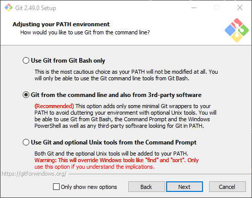
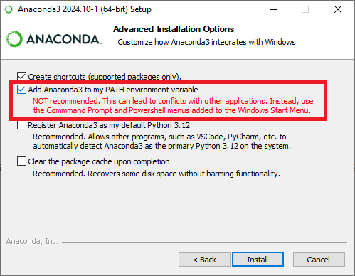

# prizm-public

PRIZM is a napari-based toolkit for zebrafish cardiac analysis.

## Table of Contents

- [Overview](#overview)
- [Requirements](#requirements)
- [Installation](#installation)
- [How to Confirm PRIZM Installed Correctly](#how-to-confirm-prizm-installed-correctly)
- [Reinstall / Update](#reinstall--update)
- [Running Demo Dataset](#running-demo-dataset)
- [GUI Usage](#gui-usage)
  - [PRIZM Batch Segmentation](#prizm-batch-segmentation)
  - [PRIZM MoA 2-Stage Prediction](#prizm-moa-2-stage-prediction)
  - [PRIZM MiniPanel HeatmapLDA](#prizm-minipanel-heatmaplda)
- [Command-Line Usage](#command-line-usage)
  - [`prizm-batch-segmentation`](#prizm-batch-segmentation-1)
  - [`prizm-moa-2stage`](#prizm-moa-2stage)
  - [`prizm-minipanel-analysis`](#prizm-minipanel-analysis)
- [License](#license)

## Overview

This repository provides the PRIZM napari plugin and companion CLIs for:

- batch segmentation and downstream functional analysis from organized
  image folders
- 2-stage mode-of-action prediction from `PerFishMetrics_*.xlsx`
  workbooks
- MiniPanel visualization and statistics from
  `PerFishMetrics_*.xlsx` workbooks

The napari manifest currently exposes three widgets:

- `PRIZM Batch Segmentation`
- `PRIZM MoA 2-Stage Prediction`
- `PRIZM MiniPanel Heatmap/LDA`

## Requirements

PRIZM is a Python package and napari plugin. The package requires
Python 3.10 or newer. The current release has been validated on
Windows 11 and Ubuntu 24.04.2 LTS.

CPU execution does not require non-standard hardware. GPU inference is
optional and requires an NVIDIA GPU with a compatible NVIDIA driver and
CUDA/cuDNN runtime. The demo run below was validated on Ubuntu 24.04.2
LTS with NVIDIA GeForce RTX 3080 GPU, NVIDIA driver 580.159.03, and
CUDA 13.0.

The README installation and demo commands were validated with these
software versions:

<details>
  <summary>Tested software versions (click to expand)</summary>

| Software | Tested version |
| --- | --- |
| PRIZM package | `prizm-napari 0.0.1` |
| Python | `3.12.13` |
| Conda | `25.5.1` |
| napari | `0.7.0` |
| magicgui | `0.10.2` |
| PyQt5 | `5.15.11` |
| QtPy | `2.4.3` |
| NumPy | `2.4.6` |
| pandas | `3.0.3` |
| SciPy | `1.17.1` |
| matplotlib | `3.10.9` |
| scikit-image | `0.26.0` |
| OpenCV | `opencv-python 4.13.0.92` |
| dask | `2026.3.0` |
| tifffile | `2026.5.15` |
| PyTorch | `2.12.0+cu130` |
| torchvision | `0.27.0` |
| segmentation-models-pytorch | `0.5.0` |
| openpyxl | `3.1.5` |
| scikit-learn | `1.8.0` |
| statsmodels | `0.14.6` |
| umap-learn | `0.5.12` |
| ONNX | `1.21.0` |
| ONNX Runtime | `onnxruntime 1.26.0` by default; `onnxruntime-gpu 1.26.0` for optional GPU inference |
| seaborn | `0.13.2` |
| tqdm | `4.67.3` |

</details>

See [pyproject.toml](pyproject.toml) and [requirements.txt](requirements.txt)
for the package-defined dependency list.

## Installation

These instructions are written for Windows first and assume you are
starting from a fresh machine. If you are using macOS or Linux, use
Terminal instead of Anaconda Prompt and replace Windows commands such as
`dir` and `where` with the equivalents for your platform.

The demo dataset and pretrained model files can be found at https://doi.org/10.6084/m9.figshare.32109697.

1. Install Git.

Download and install Git from the
[Git website](https://git-scm.com/downloads).

<details>
  <summary>(Click to see screenshot) If you are not familiar with Git or the terminal, make sure Git is added to PATH during installation.</summary>
  
</details>

Verification:

```bat
git --version
```

You should see a version number such as `git version 2.x.x`.

2. Install Anaconda (Conda).

Download and install Anaconda from the
[Anaconda website](https://www.anaconda.com/download/success).

<details>
  <summary>(Click to see screenshot) If you are not familiar with Conda or the terminal, make sure Anaconda is added to PATH during installation.</summary>
  
</details>

Verification:

```bat
conda --version
```

You should see a version number such as `conda 24.x.x`.

3. Open the Anaconda Prompt.

For a Windows beginner, this is the safest terminal to use for the rest
of the installation.

Verification:

```bat
conda info --envs
```

If this prints a list of environments, the prompt is ready to use.

4. Clone this repository:

```bat
git clone https://github.com/NICALab/prizm-public.git
```

Verification:

```bat
dir
```

You should see a folder named `prizm-public`.

5. Move into the cloned repository:

```bat
cd prizm-public
```

Verification:

```bat
cd
```

The printed path should end with `prizm-public`.

6. Create a Conda environment:

```bat
conda create -n prizm-env python=3.12
```

When Conda asks you to confirm, type `y` and press Enter.

Verification:

```bat
conda env list
```

You should see an environment named `prizm-env`.

7. Activate the environment:

```bat
conda activate prizm-env
```

Verification:

```bat
python --version
where python
```

The prompt usually starts with `(prizm-env)`, and `python --version`
should print a Python 3.12 version.

8. Install napari:

```bat
pip install "napari[all]"
```

Verification:

```bat
python -m pip show napari
```

You should see package information for `napari`.

9. Install this repository and its required dependencies from the cloned
checkout.

This command installs the Python package named `prizm-napari` from your
local `prizm-public` folder.

```bat
pip install .
```

Verification:

```bat
python -m pip show prizm-napari
```

You should see package information for `prizm-napari`.

10. Optional: use ONNX Runtime GPU on NVIDIA CUDA.

The default install above gives you the CPU ONNX Runtime package. If you
want PRIZM ONNX inference to use an NVIDIA GPU, replace the CPU runtime
with the GPU runtime that matches your CUDA stack.

For CUDA 12.x:

```bat
python -m pip uninstall -y onnxruntime onnxruntime-gpu
python -m pip install "onnxruntime-gpu[cuda,cudnn]"
```

For CUDA 11.x:

```bat
python -m pip uninstall -y onnxruntime onnxruntime-gpu
python -m pip install flatbuffers numpy packaging protobuf sympy
python -m pip install onnxruntime-gpu --index-url https://aiinfra.pkgs.visualstudio.com/PublicPackages/_packaging/onnxruntime-cuda-11/pypi/simple/
```

You still need a compatible NVIDIA driver and CUDA/cuDNN runtime on the
system. If you are also using GPU PyTorch, install the PyTorch build
that matches your CUDA setup.
Verification:

```bat
python -m pip show onnxruntime-gpu
```

If you installed the GPU runtime, this command should show package
information for `onnxruntime-gpu`.

Note: after replacing `onnxruntime` with `onnxruntime-gpu`, `python -m pip check`
may report that `prizm-napari` requires `onnxruntime`. This is a package
metadata limitation because the GPU package provides the same importable
`onnxruntime` module. The GPU runtime is working if this command lists
`CUDAExecutionProvider`:

```bat
python -c "import onnxruntime as ort; print(ort.get_available_providers())"
```

Typical installation time on a normal desktop computer is 10-20 minutes
for the CPU installation, plus 5-20 additional minutes for the optional
GPU ONNX Runtime packages depending on network speed.

## How to Confirm PRIZM Installed Correctly

Run these checks after the installation steps above.

1. Confirm the package is installed:

```bat
python -m pip show prizm-napari
```

You should see package information including the package name and
installation location.

2. Confirm Python can import the package:

```bat
python -c "import prizm_napari; print(prizm_napari.__version__)"
```

If this prints a version number and no error, the Python package is
installed correctly.

3. Confirm the CLI commands were installed:

```bat
prizm-batch-segmentation --help
prizm-moa-2stage --help
prizm-minipanel-analysis --help
```

Each command should print a help message instead of an error.

4. Confirm the napari plugin loads:

```bat
napari
```

When napari opens, go to `Plugins -> PRIZM`. You should see the PRIZM
widgets listed there.

If napari opens and the `PRIZM` menu entries are visible, the GUI
installation is working.

## Reinstall / Update

If you already cloned the repository and want to refresh your local
installation:

1. Move into your existing clone:

```bat
cd \path\to\prizm-public
```

2. Activate the environment:

```bat
conda activate prizm-env
```

Verification:

```bat
python --version
```

You should still be using the `prizm-env` environment.

3. Pull the latest changes:

```bat
git pull
```

Verification:

```bat
git status
```

You should see that your branch is up to date or that the working tree
is clean.

4. Reinstall from the updated repository:

```bat
pip install .
```

Verification:

```bat
python -m pip show prizm-napari
```

You should again see package information for `prizm-napari`.

## Running Demo Dataset

The dataset from the paper (https://doi.org/10.6084/m9.figshare.32109697) can be used to verify batch
segmentation, functional analysis, and MiniPanel output generation. In
the commands below, replace `/path/to/figshare_dataset` with the folder
where you downloaded or mounted the figshare dataset.

Use the parent folder that contains the nested `Representative image dataset`
condition folder:

```text
/path/to/figshare_dataset/Representative image dataset
```

Do not select the inner folder ending in
`Representative image dataset/Representative image dataset` as the batch
segmentation root. That inner folder contains the `Series###` sample
folders directly, but PRIZM expects the root directory to contain one or
more condition folders, each of which contains sample folders.

The demo model used for validation is:

```text
/path/to/figshare_dataset/Trained_model/PRIZM-DeepLab_2026-04-21-10-55.onnx.ortfixed.onnx
```

Run the demo from an activated `prizm-env` environment:

```bash
prizm-batch-segmentation \
  --data-dir "/path/to/figshare_dataset/Representative image dataset" \
  --output-dir /path/to/prizm_demo_output \
  --model "/path/to/figshare_dataset/Trained_model/PRIZM-DeepLab_2026-04-21-10-55.onnx.ortfixed.onnx" \
  --model-type onnx \
  --input-channels 3 \
  --postprocess-masks \
  --infer-batch-size 8
```

The `--input-channels 3` option is required for this ONNX demo model.
If GPU ONNX Runtime is installed correctly, PRIZM uses the ONNX
`CUDAExecutionProvider` automatically when a compatible NVIDIA GPU is
available.

Expected demo output:

- one output folder per input series, such as `Series006`, `Series008`,
  and so on
- raw and cleaned segmentation TIFF files for each series
- JPG frame visualizations by default (`cropped`, `preprocessing`, `masked`,
  and `FS`); select TIFF instead with the GUI or CLI visualization-format
  control
- masked and FS GIFs with per-frame elapsed time and a centered 50 µm
  scale bar; GIF playback follows the recorded frame intervals and loops
  continuously
- per-series analysis outputs under each series folder
- one condition-level `PerFishMetrics_*.xlsx` workbook under
  `Representative image dataset/results`
- one top-level `batch_combined_*.csv` file

On a computer with an NVIDIA GeForce RTX
3080 GPU, this command processed 14 series with 589 frames each in around 20 minutes. The resulting
`batch_combined_*.csv` contained one row per series.

The generated `PerFishMetrics_*.xlsx` workbook can also be used to verify
the MiniPanel CLI:

```bash
prizm-minipanel-analysis \
  --data-dir "/path/to/prizm_demo_output/Representative image dataset/results" \
  --output-dir /path/to/prizm_minipanel_output
```

Expected MiniPanel output includes `panel_heatmap/mini_bar_panel.*`,
`panel_heatmap/heatmap.*`, `panel_heatmap/stats_significance.xlsx`,
`LDA_REPORT/`, and `FIGURES_300dpi/` outputs. On the same validation
computer, this MiniPanel demo completed in around 20 seconds.

## GUI Usage

### PRIZM Batch Segmentation

Use `PRIZM Batch Segmentation` to run segmentation and functional
analysis on an organized root folder of image sequences.

Expected input layout:

```text
Root Data Directory
├── {CHEMICAL}_{CONCENTRATION}/
│   ├── {SAMPLE_OR_SERIES}/
│   │   ├── frame_0.png
│   │   ├── frame_1.tif
│   │   ├── ...
│   │   └── metadata/                # optional
│   │       └── {ID}_Properties.xml  # optional
│   └── ...
└── ...
```

Basic workflow:

1. Open `Plugins -> PRIZM -> PRIZM Batch Segmentation`.
2. Set `Root Data Directory` to the parent folder containing the
   `{CHEMICAL}_{CONCENTRATION}` condition folders. Each condition folder
   must contain one or more sample/series folders with `.png`, `.jpg`,
   `.jpeg`, `.tif`, or `.tiff` frames.
3. Choose `Metadata Mode`:

   - `Manual Entry` is the GUI default. Enter the image scale in
     `Resize Scale` (micrometres per source pixel) and the seconds between
     frames in `Relative Time Interval`. The defaults are `0.9210` and
     `0.062`.
   - `Use Metadata XML` disables those two manual fields and searches each
     sample and condition folder for the matching XML metadata.
4. Set `Output Directory`. PRIZM creates the condition, sample, and results
   subfolders inside it without modifying the input data.
5. Click `Browse Model...` and choose the `.onnx` or `.pth` segmentation
   model. The file extension selects the matching `Model Type`
   automatically.
6. Set the image input:

   - `Select Channel` uses `Channel to segment`; the default `1` is the green
     channel (`0` red/gray, `2` blue).
   - `Convert to Grayscale` converts the source frames and disables the
     channel field.
7. Confirm the model settings. For an ONNX model, the exported graph already
   fixes `Backbone`, `Encoder Depth`, `Decoder Channels`, `Encoder Output
   Stride`, and `Atrous Rates`, so those fields are disabled. `Model Input
   Channels` is detected from the ONNX graph when possible; the figshare
   demo model uses `3`. The architecture fields are editable for `.pth`
   checkpoints and must match how that checkpoint was trained.
8. Leave `Inference Batch Size` at `1` unless you have tested a larger value
   with the available GPU memory.
9. Choose `Visualization Format`. `jpg` is the space-saving default; `tif`
   writes the four human-viewable frame sets as TIFF instead.
10. Keep `Postprocess masks before saving and analysis` checked. It is
    enabled by default and corrects the inference masks before PRIZM saves
    them and runs downstream measurements.
11. Optional: check `Load images and segmentations to napari` to add the
    completed image and label stacks to the open viewer. Check `Generate
    analysis visualization overlay` as well if that overlay should also be
    added to napari. Both are off by default because large batches can use a
    lot of memory.
12. Click `Run Batch`. The progress bar and `Batch Log` show the current
    sample and stage. `Stop` requests cancellation after the current work can
    stop safely.

Outputs are written to the selected output directory, including
per-sample results and a combined batch CSV.

For either visualization choice, the integer-valued raw and cleaned
segmentation label stacks are always saved as lossless TIFF. Only the
human-viewable `cropped`, `preprocessing`, `masked`/`labeled`, and `FS`
frames change format. The masked and FS GIFs receive the elapsed-time and
50 µm scale-bar burn-in; individual frame files remain unannotated.

The crop and heart-detection window are scaled from the acquisition
metadata so that different microscope pixel sizes retain approximately the
same physical field of view. The cropped image is then resized to 300 x 300
for the current PRIZM model. If metadata is missing or invalid, PRIZM uses
the existing 0.9210 µm/pixel baseline.

### PRIZM MoA 2-Stage Prediction

Use `PRIZM MoA 2-Stage Prediction` to run hierarchical MoA prediction
from `PerFishMetrics_*.xlsx` workbooks.

Basic workflow:

1. Open `Plugins -> PRIZM -> PRIZM MoA 2-Stage Prediction`.
2. Set `Excel Root Directory (recursive)` to a parent folder containing the
   `PerFishMetrics_*.xlsx` workbooks. PRIZM searches all subfolders and shows
   the number discovered.
3. Click `Pick TRAIN / Vehicle / UNKNOWN...`. Complete the dialogs in order:

   1. In `Pick TRAIN Files`, check the known training workbooks. Use `Move Up`
      and `Move Down` if their order matters.
   2. In `Pick Vehicle(Control)`, select at least one vehicle/control workbook
      from the TRAIN set.
   3. In `Edit Non-Vehicle TRAIN Group Names`, confirm or edit the MoA group
      assigned to every other TRAIN workbook.
   4. In `Pick UNKNOWN Files`, select the remaining workbooks that should be
      predicted.
4. Review `Selected Roles` before running. Vehicle workbooks must appear as
   `Vehicle`; all other TRAIN workbooks must have the intended group name.
5. Set `Output Directory`. If left blank, PRIZM creates a timestamped
   `PRIZM_2STAGE_results_*` folder under the selected Excel root.
6. `Generate visual reports` and `Include TRAIN files in prediction outputs`
   are both checked by default. Leave them checked for the complete output.
7. Keep the collapsed `Training Parameters` at their defaults unless you are
   intentionally reproducing a different validated analysis configuration.
   The current core defaults include target FPR `0.05`, minimum feature match
   `0.90`, five CV folds, robust median/MAD control statistics, Euclidean
   similarity with top `3`, `200` bagged trees, and random seed `0`.
8. Click `Run 2-Stage MoA`. When it finishes, napari displays a summary with
   the output paths.

The output directory contains `prizm_bundle_2STAGE.mat`,
`TRAIN_2STAGE_report.xlsx`, `MASTER_unknown_2STAGE.xlsx`, per-workbook
prediction files, and the visual-report files when enabled.

### PRIZM MiniPanel Heatmap/LDA

Use `PRIZM MiniPanel Heatmap/LDA` to analyze selected
`PerFishMetrics_*.xlsx` workbooks with bar panels, heatmaps, and
dimensionality-reduction views.

Basic workflow:

1. Open `Plugins -> PRIZM -> PRIZM MiniPanel Heatmap/LDA`.
2. Set `Excel Root Directory (recursive)` to a parent folder containing the
   `PerFishMetrics_*.xlsx` workbooks. PRIZM searches all subfolders and
   initially selects every discovered workbook.
3. Click `Pick Files / Order...`. Check only the workbooks to analyze and use
   `Move Up`/`Move Down` to set their display order. Selecting `OK`
   immediately opens the control/reference dialog.
4. In `Pick Control / Reference / Stats...`:

   - choose the actual vehicle/control workbook as `Control Group`;
   - choose the group used for statistical and heatmap comparisons as
     `Reference Group` (normally the same control group);
   - keep `Include reference group in heatmap` checked if its heatmap column
     should be shown;
   - enable `Save all pairwise Welch t-tests` only if the extra all-pairs
     tables are needed. It is off by default.
5. Review the selected-workbook order and the control/reference summary.
6. Set `Output Directory`. If left blank, PRIZM creates a timestamped
   `output_*` folder under the selected Excel root.
7. `Generate heatmap`, `Run Fisher LDA`, `Run PCA`, and `Run t-SNE` are all
   checked by default. Disable only the outputs you do not need. `Bar Panel
   Columns` defaults to `5`.
8. Click `Run MiniPanel Analysis`. When it finishes, napari displays a
   summary with the output paths.

The output directory contains `panel_heatmap/mini_bar_panel.*`,
`panel_heatmap/heatmap.*`, `panel_heatmap/stats_significance.xlsx`,
`LDA_REPORT/`, and `FIGURES_300dpi/` for the enabled analyses.

## Command-Line Usage

### `prizm-batch-segmentation`

Run batch segmentation and downstream analysis without napari.

```bash
prizm-batch-segmentation \
  --data-dir /path/to/data \
  --output-dir /path/to/output \
  --model /path/to/model.onnx \
  --model-type onnx \
  --input-channels 3 \
  --postprocess-masks \
  --visualization-format jpg
```

Common options:

- `--model-type {auto,onnx,pth}`
- `--channel <int>`
- `--grayscale`
- `--postprocess-masks`: postprocess inference masks before saving and
  analysis; unlike the GUI, CLI postprocessing is off unless this flag is
  supplied
- `--backbone`, `--encoder-depth`, `--decoder-channels`,
  `--encoder-output-stride`, and `--atrous-rates`: `.pth` architecture
  settings
- `--metadata-mode {xml,manual}`
- `--metadata-file <path>`
- `--resize-scale <float>`
- `--frame-interval <float>`
- `--infer-batch-size <int>`: default `1`
- `--input-channels <int>`: use `3` for the figshare ONNX demo model
- `--visualization-format {jpg,tif}`: default `jpg`; label stacks remain TIFF
- `--no-amp`

Use `prizm-batch-segmentation --help` for the full option list.

### `prizm-moa-2stage`

Run 2-stage MoA prediction from training and unknown workbook folders.

```bash
prizm-moa-2stage \
  --train-dir /path/to/train_workbooks \
  --unknown-dir /path/to/unknown_workbooks \
  --output-dir /path/to/output
```

Common options:

- `--kfold <int>`
- `--clip-z <float>`
- `--missing-frac-max <float>`
- `--min-match-frac <float>`
- `--top-features <int>`
- `--rng-seed <int>`
- `--n-trees <int>`
- `--target-fpr <float>`
- `--stage1-final-id <name>`
- `--sim-metric {euclid,cosine}`
- `--sim-top-k <int>`
- `--self-label <name>`
- `--dominance-alpha <float>`
- `--dominance-competitor-mode {mean,top2mean,best}`
- `--perm-n <int>`
- `--perm-max-exact-n <int>`
- `--no-figures`
- `--no-robust-control-stats`
- `--no-self-similarity`
- `--no-dominance-stats`
- `--no-ml-dominance-stats`
- `--include-self-in-dominance`
- `--no-train-in-analysis`

Use `prizm-moa-2stage --help` for the full option list.

### `prizm-minipanel-analysis`

Run MiniPanel analysis from a directory of Excel workbooks.

```bash
prizm-minipanel-analysis \
  --data-dir /path/to/workbooks \
  --output-dir /path/to/output
```

Common options:

- `--control-group <name>`
- `--reference-group <name>`
- `--ordered-files file1.xlsx,file2.xlsx,...`
- `--n-cols <int>`
- `--exclude-ctrl-heatmap`
- `--save-all-pairs-excel`
- `--no-heatmap`
- `--no-lda`
- `--no-pca`
- `--no-tsne`

Use `prizm-minipanel-analysis --help` for the full option list.

## License

This project is licensed under the PolyForm Noncommercial License 1.0.0.

Commercial use is not permitted without a separate license from the copyright holder.
